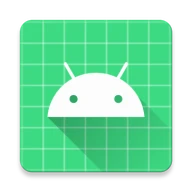

<p align="center">
  
</p>

<p align="center">
  
</p>

<h1 align="center">Viora</h1>

<p align="center">
  <strong>A digital wellbeing companion for Android that escalates gently — never bans.</strong>
</p>

<p align="center">
  Viora watches how you use your phone, understands the rhythm, and steps in with a calm nudge
  before a scroll turns into an hour. Everything happens on your device.
</p>

<p align="center">
  
  
  
  
  
</p>

---

<a id="table-of-contents"></a>
## 📑 Table of Contents

- [✨ Highlights](#highlights)
- [🎚️ The Intervention Ladder](#the-intervention-ladder)
- [🧭 Features](#features)
- [🔁 On-Device Data Flow](#on-device-data-flow)
- [🏗️ Architecture](#architecture)
- [🗂️ Project Structure](#project-structure)
- [🛠️ Tech Stack](#tech-stack)
- [🔐 Privacy & Permissions](#privacy-permissions)
- [🚀 Getting Started](#getting-started)
- [🧪 Build, Test & Quality](#build-test-quality)
- [🚧 Known Limitations & Roadmap](#known-limitations-roadmap)
- [🤝 Contributing](#contributing)
- [📄 License](#license)

---

<a id="highlights"></a>
## ✨ Highlights

| | |
|---|---|
| 📊 **Real usage tracking** | Polls `UsageStatsManager` every **5 s**, batches writes every **30 s**, and records per-app sessions with category, hour-of-day and interruption state. |
| 🎚️ **4-stage escalation ladder** | `GENTLE → REFLECT → RECOVER → PROTECT` — each stage softer than the last, each one dismissible or convertible into a focus session. |
| 🧘 **Focus sessions** | A `CircularTimer` countdown with pause/resume and early completion, persisted with planned vs. actual duration and interrupt count. |
| 📈 **Insights & weekly report** | Screen-time totals, per-app breakdown, hourly session timeline, wellbeing scoring, and a 7-day graded report. |
| 🌙 **Mindful Unlock** | An optional prompt on screen unlock that asks *why* — Work, Study, Messages, Call, Maps, Social, Just Checking — and records the answer. |
| 🔒 **Zero network** | Viora never requests `INTERNET`. No analytics, no crash reporting, no accounts, no servers. |
| 🎨 **Material 3, dark-first** | Soft lavender / blue / peach palette, optional dynamic colour, and semantic tokens for wellbeing and intervention states. |

---

<a id="the-intervention-ladder"></a>
## 🎚️ The Intervention Ladder

Most screen-time apps punish you with a hard block. Viora's philosophy is **progressive
friction**: start with a whisper, escalate only if you keep going, and always leave the user
in control.



| Level | Default trigger | Overlay copy | Screen dim | What you can do |
|---|---|---|---|---|
| `NONE` | — | — | 0 % | — |
| `GENTLE` | 30 min | *"Take a breath."* | 0 % | Swipe away — auto-dismisses after 5 s |
| `REFLECT` | 60 min | *"Let's pause for a moment."* | 40 % | **I'm done**, **5 more minutes**, or start a focus session |
| `RECOVER` | 120 min | *"Time for a breather."* | 60 % | Start a focus session, close the app, or **hold to continue** |
| `PROTECT` | 180 min | *"Time to step away."* | 80 % | Take a break, or start a focus session instead |

Levels only ever escalate **within a single session**, and an intervention fires at most once
per level — so you're never spammed. Every threshold is configurable in Settings, and each stage
is drawn from a different emotional register (calm green → warm amber → soft coral →
protective lavender), so the escalation is felt before it is read.

---

<a id="features"></a>
## 🧭 Features

### 🏠 Dashboard

Today at a glance: screen time against your daily goal, goal progress, wellbeing score, top 5
apps, an hourly session timeline, and the current week bar chart. Reacts live to the tracking
service via `StateFlow`.

### 🧘 Focus Hub & Active Session

Pick a preset (default **25 min**), run a Canvas-drawn circular countdown, pause/resume, or end
early and mark the session complete. Sessions are stored with planned vs. actual duration, a
completion flag, and an interrupt count.

### 📈 Insights

- Screen time today vs. goal, with progress
- Per-app usage bars and share of total
- Hour-by-hour session timeline
- 7-day weekly report: totals, daily average, most-used app, day-over-day change, letter grade
- Wellbeing score and level (`EXCELLENT` → `POOR`)

### 📦 Monitored Apps

Enumerates every launchable app on the device, shows usage against a per-app `dailyLimitMinutes`,
and lets you set a limit plus an intervention level per app. Categories are inferred from the
package name.

### 🌙 Mindful Unlock

An independent, opt-in pipeline with its own DataStore, its own Room table and its own overlay.
Fires ~800 ms after screen unlock, respects battery saver, and can be tuned to *always*,
*occasional*, *late night only*, *focus mode only*, *after X unlocks*, or *never*. Unlocks that
don't meet the conditions are still recorded as **skipped**, so the data stays honest.

### ⚙️ Settings

Daily goal, default focus duration, intervention enable + per-level thresholds, quiet hours,
notifications, intent checks, progressive friction, start-on-boot, and theme mode
(system / light / dark), plus per-app limits and monitored-app selection. Thresholds use a
press-and-hold circular picker (`CircularPressHoldTimePicker`) so fine-tuning feels deliberate
rather than fiddly.

### 🌱 Onboarding

A 4-page `HorizontalPager` flow — welcome → daily goal slider → apps to track → permission
explainer — that walks through granting Usage Access and Overlay permission.

---

<a id="on-device-data-flow"></a>
## 🔁 On-Device Data Flow



Five tables, 90-day retention:

| Table | Purpose | Indices |
|---|---|---|
| `usage_events` | One row per app session | `date`, `packageName`, (`date`, `hourOfDay`) |
| `focus_sessions` | Focus timer runs | `date` |
| `daily_summaries` | Rolled-up per-day aggregates | PK `date` |
| `app_limits` | Per-app limits + intervention level | PK `packageName` |
| `unlock_events` | Mindful unlock answers | `date`, `selectedReasonId`, (`date`, `hourOfDay`) |

---

<a id="architecture"></a>
## 🏗️ Architecture

**MVVM + Clean Architecture**, unidirectional data flow, dependency injection with Hilt.

```
┌──────────────────────────────────────────────────────────────┐
│  UI          Jetpack Compose · Material 3 · Navigation      │
│              Screens ─ ViewModels (StateFlow) ─ UI State     │
└───────────────────────────┬──────────────────────────────────┘
                            │  use cases
┌───────────────────────────▼──────────────────────────────────┐
│  DOMAIN      Pure Kotlin. models · repository interfaces ·  │
│              usecases (apps · dashboard · focus · insights · │
│              intervention)                                   │
└───────────────────────────┬──────────────────────────────────┘
                            │  repository implementations
┌───────────────────────────▼──────────────────────────────────┐
│  DATA        Room (viora.db v2) · DataStore · mappers ·      │
│              UsageStatsDataSource                           │
└───────────────────────────┬──────────────────────────────────┘
                            │
┌───────────────────────────▼──────────────────────────────────┐
│  MONITORING  Foreground service (specialUse) · BlockEngine · │
│              NotificationEngine · AccessibilityService       │
└──────────────────────────────────────────────────────────────┘
```

**Services & receivers**

| Component | Role |
|---|---|
| `VioraTrackingService` | `specialUse` foreground service. Polls the foreground app every 5 s, records sessions, evaluates interventions, hosts the overlay, and registers the dynamic unlock receiver. Returns `START_STICKY`. |
| `BootReceiver` | Resumes tracking after `BOOT_COMPLETED` when *start on boot* is enabled. |
| `VioraAccessibilityService` | `BIND_ACCESSIBILITY_SERVICE`; observes `TYPE_WINDOW_STATE_CHANGED` so Viora knows when the foreground app changes. Window-content retrieval is **not** requested. |
| `UnlockReceiver` | Static `USER_PRESENT` receiver for Mindful Unlock, plus a dynamically registered receiver inside the tracking service. |
| `DailySummaryWorker` | Hilt-injected `CoroutineWorker` that rolls the previous day's summary. |
| `OverlayManager` | Hosts Compose overlays through `WindowManager` `TYPE_APPLICATION_OVERLAY`. |

---

<a id="project-structure"></a>
## 🗂️ Project Structure

```
viora/
├── app/src/main/java/com/example/viora/
│   ├── accessibility/      # AccessibilityService
│   ├── di/                 # Hilt modules: Database, Engine, Repository
│   ├── data/
│   │   ├── database/       # Room DB, 5 entities, 5 DAOs
│   │   ├── datastore/      # UserPreferencesDataStore
│   │   ├── mapper/         # Entity <-> domain mappers
│   │   ├── repository/     # Repository implementations
│   │   └── source/         # UsageStatsManager wrapper
│   ├── domain/
│   │   ├── model/          # AppLimit, FocusSession, Insight, WeeklyReport, ...
│   │   ├── repository/     # Interfaces
│   │   └── usecase/        # apps / dashboard / focus / insights / intervention
│   ├── mindful/            # Self-contained Mindful Unlock feature
│   │   ├── data/           # Own DataStore + unlock_events repository
│   │   ├── domain/         # UnlockEvent, UnlockReason, UnlockFrequency
│   │   ├── service/        # OverlayManager, UnlockReceiver
│   │   └── ui/             # Overlay content, settings, stats
│   ├── monitoring/         # BlockEngine · NotificationEngine
│   ├── service/            # VioraTrackingService · BootReceiver · OverlayManager
│   ├── ui/                 # Compose screens, components, theme, navigation
│   └── util/               # Constants · TimeUtils · Logger · detectors · worker
├── app/schemas/            # Exported Room schemas (v1, v2)
├── gradle/libs.versions.toml
└── assets/                 # Animated assets used by this README
```

**Stats:** 126 Kotlin files · ~10 k lines · `minSdk 26` · `targetSdk 35` · Java 17.

---

<a id="tech-stack"></a>
## 🛠️ Tech Stack

<table>
<tr><td align="center"><b>UI</b></td><td>


</td><td align="center"><b>Architecture</b></td><td>


</td></tr>
<tr><td align="center"><b>Data</b></td><td>


</td><td align="center"><b>Build</b></td><td>


</td></tr>
<tr><td align="center"><b>Platform</b></td><td colspan="3">


</td></tr>
</table>

---

<a id="privacy-permissions"></a>
## 🔐 Privacy & Permissions

Viora is **local-first by construction**. There is no `INTERNET` permission in the manifest, no
telemetry SDK, no account, and no analytics. Uninstalling removes everything.

| Permission | Why Viora needs it |
|---|---|
| `PACKAGE_USAGE_STATS` | Read which app is in the foreground and for how long. Granted from Settings, never silently. |
| `SYSTEM_ALERT_WINDOW` | Draw the intervention and Mindful Unlock overlays on top of other apps. |
| `FOREGROUND_SERVICE` + `FOREGROUND_SERVICE_SPECIAL_USE` | Keep the tracking loop alive so sessions are recorded accurately. |
| `POST_NOTIFICATIONS` | The persistent tracking notification and intervention backups. |
| `RECEIVE_BOOT_COMPLETED` | Resume tracking after a reboot when *start on boot* is enabled. |

Backup and device-transfer rules explicitly exclude `sharedpref` and `databases`, so your history
doesn't escape through Android backup either.

---

<a id="getting-started"></a>
## 🚀 Getting Started

### Prerequisites

| Tool | Version |
|---|---|
| Android Studio | Ladybug or newer (AGP 8.10) |
| JDK | 17 |
| Android SDK | Platform 35 |
| Gradle | 8.11.1 (via the bundled wrapper) |
| Device / emulator | Android 8.0 (API 26) or newer |

### Clone & run

```bash
git clone https://github.com/<your-username>/viora.git
cd viora

# Point Gradle at your SDK (or let Android Studio do it)
# local.properties -> sdk.dir=/path/to/Android/sdk

./gradlew :app:assembleDebug     # build the debug APK
./gradlew :app:installDebug      # install on a connected device
```

On Windows:

```powershell
git clone https://github.com/<your-username>/viora.git
cd viora
.\gradlew.bat :app:assembleDebug
.\gradlew.bat :app:installDebug
```

### First launch

Viora walks you through onboarding, then asks for Usage Access and Overlay permission. Grant
both and tracking begins — the persistent notification is your proof it's alive.

> Usage Access is a **special-access** grant, so it can't be requested through a runtime dialog.
> Find it at `Settings → Apps → Special app access → Usage access`.

---

<a id="build-test-quality"></a>
## 🧪 Build, Test & Quality

```bash
./gradlew :app:assembleDebug              # debug APK
./gradlew :app:assembleRelease            # release APK (R8 + resource shrinking)
./gradlew :app:testDebugUnitTest          # JVM unit tests
./gradlew :app:connectedDebugAndroidTest  # instrumented tests (needs a device)
./gradlew :app:lintDebug                  # Android Lint
```

Release builds enable `minifyEnabled` and `shrinkResources`, with keep rules in
`app/proguard-rules.pro`.

> **Testing status:** the suite currently contains only the generated `ExampleUnitTest` and
> `ExampleInstrumentedTest` templates. Domain logic — wellbeing scoring, streaks, weekly report
> grading, intervention thresholds — is the highest-value place to add coverage next.

---

<a id="known-limitations-roadmap"></a>
## 🚧 Known Limitations & Roadmap

Viora is a **work in progress**, and this section is intentionally honest. Current gaps in
priority order:

| # | Gap | Impact |
|---|---|---|
| 1 | Intervention thresholds are configured in **minutes** but compared against **seconds** in the tracking service | The default 30/60/120/180 thresholds fire ~60× too early |
| 2 | Session elapsed time is advanced by a fixed `+5 s` per poll tick instead of wall-clock time | Session durations drift from reality |
| 3 | Pickup counting is never called, so all pickup metrics read `0` | Pickup figures and part of the wellbeing score are inert |
| 4 | Dashboard `currentStreak`, `timeSavedMinutes` and `weeklyChangePercent` are hardcoded `0` | Three headline stats always read zero |
| 5 | The persisted daily summary hardcodes `wellbeingScore = 50` | Historical scores are placeholders |
| 6 | No Room migrations — `fallbackToDestructiveMigration()` is used | A DB version bump wipes user history |
| 7 | Onboarding completion isn't persisted | The first-run flow can't be skipped or resumed |
| 8 | Several UI components and use cases are built but not yet wired (`UsageHeatmap`, `WeeklyTrendChart`, `WellbeingScoreRing`, `StartFocusSessionUseCase`, …) | Dead code waiting for integration |
| 9 | Mindful Unlock persists haptics / show-stats / animation-speed settings but the overlay doesn't read them | Three toggles currently do nothing |
| 10 | Ambient sound is stored on a focus session but nothing plays it | No audio layer yet |
| 11 | Several settings keys are declared in DataStore with no consumer (`accentColor`, `weeklyReportEnabled`, `reducedMotion`) | Dead settings |

### Next up

- [ ] Fix the minutes/seconds unit mismatch and switch to wall-clock session timing
- [ ] Implement real pickup counting via the accessibility service
- [ ] Wire the streak / time-saved / weekly-change metrics to real queries
- [ ] Add proper Room `Migration` objects and drop destructive fallback
- [ ] Wire the unused Compose components and use cases into their screens
- [ ] Persist onboarding completion and add a resettable onboarding
- [ ] Unit-test the domain layer (wellbeing score, streak, weekly report, thresholds)
- [ ] Add the ambient audio layer for focus sessions

---

<a id="contributing"></a>
## 🤝 Contributing

Contributions are welcome — issues, ideas, and pull requests alike.

1. **Fork** the repository and create a branch off `main`.
2. Keep to the existing architecture: `ui` → `domain` → `data`. Domain stays pure Kotlin.
3. Follow the conventions already in the file you're editing — package layout, Hilt annotations,
   Compose component structure.
4. Run `./gradlew :app:lintDebug` and the test tasks before opening a PR.
5. Write a clear PR description: what changed, why, and how you verified it.

```bash
git checkout -b feature/my-change
# ... work ...
git add -A
git commit -m "feat(insights): add weekly trend chart"
git push -u origin feature/my-change
```

Please don't add network permissions, analytics, or any third-party tracking — keeping Viora
completely on-device is a core product promise, not an accident.

---

<a id="license"></a>
## 📄 License

**No license file has been added yet.** Before making this repository public, add one — for
example `MIT` (permissive, common for apps) or `Apache-2.0` (explicit patent grant). Until a
license is added, the code is technically all-rights-reserved and nobody can legally reuse it.

---

<a id="acknowledgements"></a>
## 🙏 Acknowledgements

Built with the Android Jetpack libraries — Compose, Room, Hilt, DataStore, WorkManager — and
standing on the shoulders of the open-source Android community.

